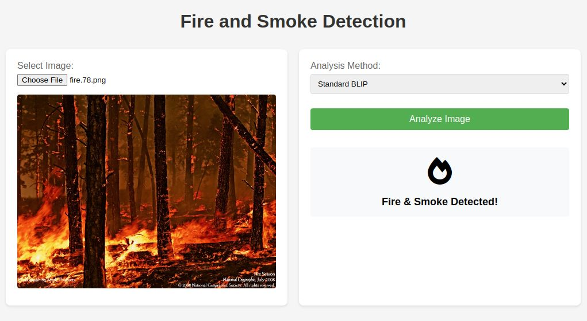
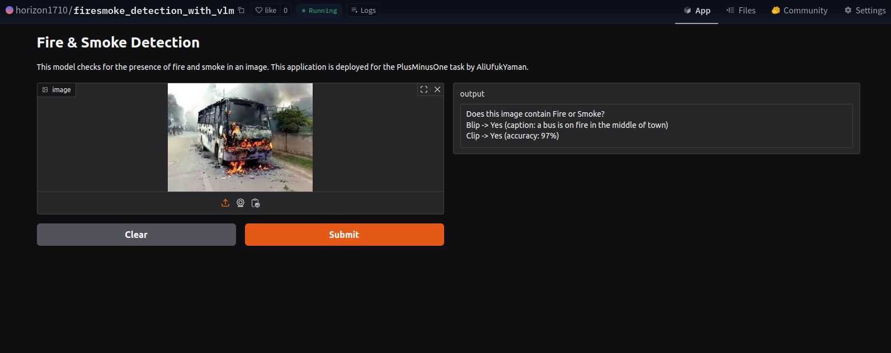

# Fire & Smoke Detection with VLM
This application analyzes the presence of **fire or smoke** in an image using a visual language model.
This project is organized using a Docker Compose environment for ease of execution and the *Dockerfile* is based on the CUDA 12.1.0 base image.
**The Blip model** (Bootstrapping Language-Image Pretraining) was used in the implementation of this project. Blip is a vision-language pretraining model designed to integrate language and visual information effectively, enabling tasks like image captioning and visual question answering. Information and study about the Blip model and other alternatives will be discussed further in the continuation of this page.

## Overview

The application provides a single REST API endpoint that accepts an image and a model selection, analyzes the image, and returns the result. *FastAPI* is used for developing the REST API. Additionally, a static HTML page was created and served using FastAPI. This HTML page allows users to upload images, select model type, and send a request to the REST API endpoint. Once the request is processed, the results are displayed on the page.


## Requirements

- A *Linux* device is required to run the docker.
- The models are configured to work with *GPUs*. For optimal performance, an NVIDIA GPU is required. If no GPU is available, the application will automatically run on the CPU.
- The followings must be installed on your system:
  - Docker & Docker Compose
  - NVIDIA Container Toolkit

- Since the fine-tuned model is quite large (~900MB) and it can not be added to this repo, if this model needs to be tested, it can be downloaded from the link provided below. After extracting the files, the folder named "blip-fire-smoke-finetuned" should be placed inside the "models" directory of the repository. If it has been added afterward, you may need to rebuild the Docker image.
    ```bash
    https://drive.google.com/file/d/1WI1Mv-AGx_Eykj5EcKSHhzHqFbTGej4C/view?usp=drive_link
## Running the Application

1. Clone this repository:
    ```bash
   git clone https://github.com/aliufukyaman/fire_and_smoke_detection_vlm.git
   cd fire_and_smoke_detection_vlm
2. Build the Docker image:
    ```bash
    docker-compose build
3. Start the Docker container:
    ```bash
    docker-compose up
4. Once the container is running, access the application via your browser at:
    ```bash
    http://localhost:8071

## Model Selection
For fire and smoke detection, I have worked with BLIP and CLIP. I’ll also briefly mention two other Vision-Language Models (VLMs): UniT and ViLT, explaining why BLIP and CLIP were preferred.

1. **BLIP** (Bootstrapping Language-Image Pretraining): BLIP combines image and text understanding using bootstrapping techniques to improve performance in visual and language-based tasks.
Why it’s suitable: BLIP effectively recognizes complex patterns like smoke or fire and relates them to natural language descriptions. Its robust pretraining makes it ideal for diverse environments and dynamic events like fires and smoke. It performs high accuracy on Fire and Smoke classification. 
2. **CLIP** (Contrastive Language-Image Pretraining)
Overview: CLIP uses contrastive learning to associate images with textual descriptions, allowing zero-shot classification.
Why it’s suitable: CLIP’s zero-shot learning capabilities make it flexible and effective for detecting fire or smoke with minimal labeled data. Its ability to generalize across different visual inputs is ideal for dynamic scenarios. It also performs high accuracy on Fire and Smoke classification.
3. **UniT** (Unified Transformer for Vision-Language Tasks)
Overview: UniT is a transformer-based model for a wide range of vision-language tasks, using a joint embedding space for images and text.
Why it was not chosen: While versatile, UniT’s general-purpose design isn’t as suitable for fire and smoke detection as BLIP and CLIP, which are more optimized for task-specific learning, also accuracy with pretrained model was not sufficient.
4. **ViLT** (Vision-and-Language Transformer)
Overview: ViLT uses an efficient transformer architecture to process both images and text without convolutions.
Why it was not chosen: ViLT is efficient but may lack the deep visual understanding needed for fire and smoke detection. BLIP and CLIP multimodal learning capabilities provided better context and accuracy for this task.


## Model Evaluation and Fine-tuning

### Dataset Information
For evaluating and fine-tuning the models, I used publicly available datasets:

- **FSD** (Fire and Smoke Dataset): A large-scale dataset with fire and smoke images across various environments.
- **FLAME** (Fire and Smoke Detection Dataset): A dataset designed for fire and smoke detection tasks, containing images and videos in diverse scenarios.
- **FireNet**: A dataset focused on fire detection, providing images with varying degrees of fire and smoke.

From these datasets, I selected 1000 images containing fire and smoke and 1000 images without fire and smoke. I divided the data into training (80%), validation (10%), and test (10%) sets, which corresponds to **1600** training images, **200** validation images, and **200** test images. (I’ve also included this dataset in the repository.)

### Approaches & Fine-Tuning
Before fine-tuning the Blip model, I tried different approaches to increase the accuracy of Fire and Smoke classification..

#### Blip Model:
The Blip model generates a caption for a given *image*. My approach was to search for *specific keywords* within the generated captions. After extensive testing, I determined the following keywords to be the most relevant:
- “fire,” “smoke,” “flame,” “burning,” “blaze,” “explosion,” and “burn.” 

By searching for these keywords, I achieved the best results for both classes. (Accuracy results are discussed below.)

Also keeping *num_beams* low (1 actually in my case) performed the best accuracy as it directly focus on the content.
On my setup, the inference time with GPU and CPU is around 50ms and 600ms respectively. 
#### CLIP Model:
The CLIP model takes an *image* and *multiple text* descriptions (2 or more) and uses softmax to calculate the probability of how well the texts align with the image. Based on my tests, I found out that the most successful pair of text values for CLIP were:
- “A photo of a dangerous burning fire or smoke”
- “A photo of a calm scene without any fire or smoke”

Also setting the threshold for fire and smoke probability around 0.85 performed with the best accuracy in my case.
On my setup, the inference time with GPU and CPU is around 20ms and 250ms respectively. 

#### BLIP Model VS CLIP Model:

This table summarizes the key differences between **BLIP (Bootstrapped Language-Image Pretraining)** and **CLIP (Contrastive Language-Image Pretraining)** models.

| **Feature**          | **BLIP**                       | **CLIP**                        |
|-----------------------|---------------------------------|----------------------------------|
| **Purpose**           | Image captioning, Visual Question Answering (VQA) | Zero-shot classification         |
| **Complexity**        | Larger and more complex        | Lighter and faster              |
| **Number of Layers**  | 12-24 (ViT-based)              | 12-24 (ViT or ResNet-based)     |
| **Parameter Count**   | 100M-400M                      | 150M-300M                       |
| **Training Strategy** | Multiple tasks (e.g., captioning, VQA) | Contrastive learning            |

#### Fine-Tuning Results
In addition to the above, I *fine-tuned* the BLIP model, and this resulted with the highest accuracy I got.
The **reason I preferred BLIP model for finetuning** is just because its promising accuracy and robustness. CLIP model is more lightweight but at my case I prefered BLIP model as I cared more about accuracy.
When fine-tuning, I trained the model using the following labels (ramdomly within the class) based on my dataset classes. The fine-tuned model learned to assign one of these captions to the images, effectively creating a highly successful classifier.

**Captions** for fire and smoke images:
- “A fire is burning with thick smoke.”
- “Flames and smoke are visible in the image.”
- “There is a fire with heavy smoke.”
- “Smoke is rising from a fire.”

**Captions** for non-fire and smoke images:
- “No fire or smoke is present in the image.”
- “The scene is clear with no signs of fire or smoke.”
- “There is no fire or smoke in this image.”
- “Everything looks normal with no fire or smoke.”

The details about the fine-tuning steps are commented in related code under 'training_and_evaluating' folder 
### Accuracy Results
Here are the accuracy results for all tests:

| Model             | Fire&Smoke Accuracy | Non Fire&Smoke Accuracy |
| ----------------  | ----------------    | ----------------        |
| BLIP (Original)   | 93.90%              | 98.10%                  |
| CLIP (Original)   | 97.30%              | 92.80%                  |
| BLIP (Fine-tuned) | 98.60%              | 99.80%                  |

### Model Availability and Test Environment
Both the Blip original and Blip fine-tuned models are available within this Docker Project.

The solution with the Blip original and Clip original models is deployed on *Hugging Face Space*:
    ```bash
    https://huggingface.co/spaces/horizon1710/firesmoke_detection_with_vlm



### Code Comments
In addition to the explanations above, I’ve documented the steps and processes directly in the code comments.

## Conclusion
As a result, I have demonstrated that with powerful VLM models like BLIP and CLIP, it’s possible to easily create simple classifiers with these powerful Vision Language Models, without the need for complex and time-consuming classifier & detector trainings. With minimal fine-tuning, these models can deliver excellent performance for these kind of problems.